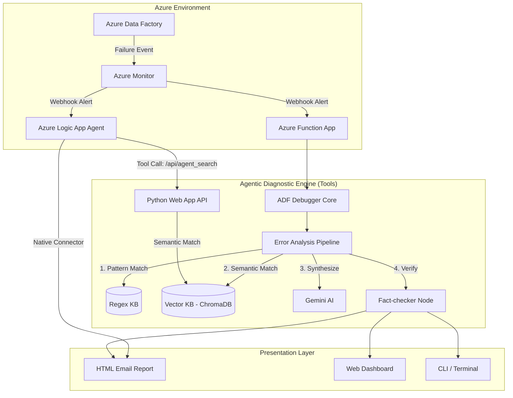

# 🔧 Agentic AI ADF Pipeline Debugger

[](https://www.python.org/downloads/release/python-3120/)
[](https://opensource.org/licenses/MIT)
[](https://azure.microsoft.com/en-us/products/data-factory/)
[](https://deepmind.google/technologies/gemini/)

**An enterprise-grade, AI-powered diagnostic and observability system for Azure Data Factory (ADF).**

This system automatically monitors, detects, analyzes, and explains ADF pipeline failures, delivering human-centric observability to data engineering teams. Rather than reacting to obscure JSON error codes in the middle of the night, teams receive comprehensive, fact-checked root cause analyses with actionable remediation steps.

---

## ✨ Enterprise Features

- 🤖 **Agentic Error Analysis:** Leverages Google's Gemini AI to synthesize complex Azure error codes into human-readable explanations.
- 🧠 **Semantic Knowledge Base:** Uses ChromaDB and `sentence-transformers` for vector-based retrieval across 30+ historical ADF failure patterns.
- 🛡️ **Automated Fact-Checking:** A dedicated verification agent guarantees that AI-generated solutions align with official Azure documentation and internal runbooks.
- 📊 **Real-Time Observability:** A robust web dashboard (Azure App Service) for monitoring pipeline health.
- ⚡ **Proactive Alerting:** Native Azure Monitor integration polls for failures every 5 minutes and triggers deep diagnostic workflows.
- 📧 **Actionable HTML Reports:** Rich diagnostic emails localized to your team's context via Gmail SMTP integrations.
- 🔍 **Data Quality Enforcement:** Automated validations for execution variance, unusual volume spikes, and cyclic failures.

---

## 🏗️ Architecture



### Two Orchestration Models

1. **Azure Logic App Autonomous Agent (Recommended):** The Logic App uses an AI Agent loop (`gpt-4o`) to orchestrate the pipeline. It retrieves the error, dynamically calls the Python Web App's `/api/agent_search` endpoint (Vector Knowledge Base) as a custom tool, synthesizes a response, and emails the team using native Logic App connectors.
2. **Python Function App (Standalone):** An Azure Function triggers on ADF failure alerts. It extracts pipeline logs, queries the local ChromaDB and Regex KBs, calls Gemini AI to synthesize an explanation, verifies it with a Fact-Checking Node, and routes an HTML report via SMTP.

---

## 🚀 Getting Started

### Prerequisites

Ensure you have the following before cloning the repository:
- **Python 3.12+**
- Active **Azure Subscription** with an existing Azure Data Factory instance.
- **Service Principal** with `Data Factory Contributor` or `Reader` access.
- **Google Gemini API Key**.
- Standard **Gmail Account** (with App Passwords enabled for SMTP).

### 1. Installation

Clone the repository and install the dependencies:

```bash
git clone https://github.com/DevinHansa/Agentic_AI_ADF_Pipeline_Debugger.git
cd Agentic_AI_ADF_Pipeline_Debugger

# Create and activate a virtual environment (recommended)
python -m venv venv
source venv/bin/activate  # On Windows use `venv\Scripts\activate`

# Install requirements
pip install -r requirements.txt
```

### 2. Configuration

Create a local environment file and populate it with your specific credentials:

```bash
cp .env.example .env
```

**Required `environment` variables:**

| Variable | Description |
|----------|-------------|
| `AZURE_SUBSCRIPTION_ID` | Your Azure Subscription ID. |
| `AZURE_RESOURCE_GROUP` | The Resource Group hosting the ADF instance. |
| `AZURE_DATA_FACTORY_NAME` | The exact name of your ADF resource. |
| `AZURE_TENANT_ID` | Your Azure AD Tenant ID. |
| `AZURE_CLIENT_ID` | Service Principal Client ID. |
| `AZURE_CLIENT_SECRET` | Service Principal Secret. |
| `GEMINI_API_KEY` | Your Google Gemini API Key. |
| `SMTP_USERNAME` | The Gmail address used for sending alerts. |
| `SMTP_PASSWORD` | The secure App Password for the Gmail account. |
| `EMAIL_TO` | Comma-separated list of recipient emails. |

### 3. Verification

Test the integration to Azure and the AI models:
```bash
python cli.py test-connection
```

---

## 🛠️ Usage & Operations

The system provides a unified CLI for manual interventions and investigations.

### Common Commands

```bash
# Monitor the last 24 hours of pipeline execution
python cli.py failures --hours 24

# Perform a deep diagnostic on a specific ADF Run ID
python cli.py debug <run_id_here> --save-html report.html --send-email

# Bring up the interactive Dashboard
python dashboard.py

# Run in an isolated Demo Mode (Does not require an active Azure connection)
python cli.py demo --scenario 0
```

---

## ☁️ Azure Deployment (Production)

To deploy the solution to Azure for production monitoring:

### 1. Web Dashboard (Azure App Service)
Deploy the Flask-based dashboard:
```bash
az webapp up --name adf-debugger-dashboard \
  --resource-group rg-adf-mads-mvp \
  --runtime "PYTHON:3.12"
```

Configure application settings for the App Service:
```bash
az webapp config appsettings set --name adf-debugger-dashboard \
  --resource-group rg-adf-mads-mvp \
  --settings AZURE_SUBSCRIPTION_ID="..." GEMINI_API_KEY="..." # Include all .env vars
```

### 2. Azure Function Alert Webhook
Deploy the Azure Function (found in the `azure_function` directory) to act as the webhook target for Azure Monitor alerts.

---

## 🧪 Testing

We provide pre-defined, fault-injected pipeline templates to test the system's analytical capabilities safely.

| Pipeline Definition | Purpose | Expected Fault Detection |
|---------------------|---------|--------------------------|
| `pl_sales_ingest_fail_404` | Simulates a missing blob trigger | `PathNotFound` (ADLS Gen2) |
| `pl_test_connectivity` | Simulates a networking partition | DNS / Outbound Connection Failure |
| `pl_test_auth_fail` | Simulates Service Principal expiration | `Unauthorized` Access |
| `pl_test_timeout` | Simulates slow linked services | HTTP 408 (Timeout) |
| `pl_test_bad_url` | Simulates an upstream API outage | HTTP 500 (Internal Server Error) |

Run the test suite:
```bash
pytest tests/ -v
```

---

## 🤝 Contribution Guidelines

This repository follows standard Git Flow protocols. We welcome contributions to enhance the knowledge base or the agentic toolchain.

1. Fork the project.
2. Create your Feature Branch: `git checkout -b feature/AmazingFeature`
3. Commit your Changes: `git commit -m 'Add some AmazingFeature'`
4. Push to the Branch: `git push origin feature/AmazingFeature`
5. Open a Pull Request.

**Adding new knowledge base patterns:** Register new embeddings in `vector_knowledge_base.py` and test using `python cli.py demo`.

---

## 📄 License & Legal

Distributed under the MIT License. See `LICENSE` for more information.

*Note: This project is an independent observability tool and is not officially affiliated with Microsoft Corp.*
